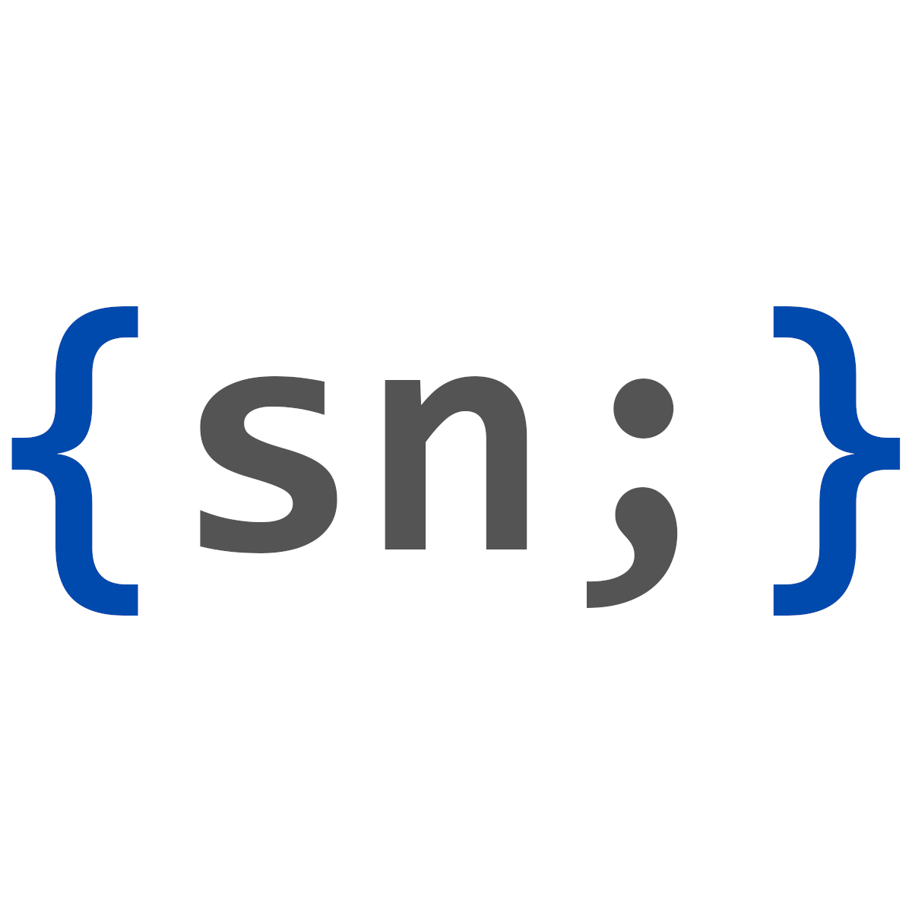

# Syedn Tech - Laravel Helper

<p align="center">
  <a href="https://github.com/syedn-tech/laravel-helper">
    
  </a>
</p>

[](https://packagist.org/packages/syedn-tech/laravel-helper)
[](https://packagist.org/packages/syedn-tech/laravel-helper)

A collection of useful helper functions and classes to accelerate Laravel development at SYEDN Tech Solutions.

## Installation

You can install the package via composer:

```bash
composer require syedn-tech/laravel-helper